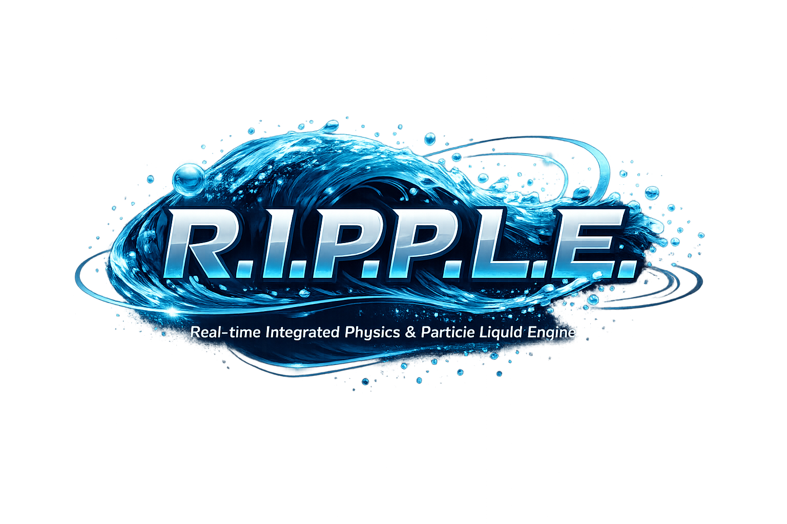

<div align="center">
  
  <h1>R.I.P.P.L.E</h1>
  <p><i>Real-time Integrated Physics & Particle Liquid Engine</i></p>

  <p>
    <a href="https://github.com/NullCipherr/ripple-engine/actions/workflows/main.yml"></a>
    
    
    
  </p>
</div>

<p align="center">
  <strong>English</strong> | <a href="./README.pt-BR.md">Portuguese (Brazil)</a>
</p>

---

## Overview

**R.I.P.P.L.E** isolates simulation/rendering logic from the UI application layer.

This repository contains only:

- fluid numerical solver;
- obstacle and particle system;
- WebGL2 renderer and shaders;
- public type contracts for integration.

The UI layer (React and components) is not part of this package.

---

## Documentation

- [Documentation index](docs/README.md)
- [Architecture](docs/pt-br/ARQUITETURA.md)
- [Public API](docs/pt-br/API_PUBLICA.md)
- [Operations](docs/pt-br/OPERACAO.md)
- [Performance](docs/pt-br/PERFORMANCE.md)
- [Official Adapters](docs/pt-br/ADAPTADORES_OFICIAIS.md)
- [WebGPU Experimental](docs/pt-br/WEBGPU_EXPERIMENTAL.md)
- [Testing and Quality](docs/pt-br/TESTES_E_QUALIDADE.md)
- [Releases and Versioning](docs/pt-br/RELEASES_E_VERSIONAMENTO.md)
- [Roadmap](docs/pt-br/ROADMAP.md)
- [Simulator Migration](docs/pt-br/MIGRACAO_DO_SIMULADOR.md)
- [Version-to-Version Migration](docs/pt-br/MIGRACAO_ENTRE_VERSOES.md)
- [Official Examples](examples/README.md)

---

## Installation

```bash
npm install github:NullCipherr/ripple-engine#v1.0.0
```

This project is **not initially published to npm**. External usage is distributed via GitHub tags/releases.

For local development:

```bash
npm install
npm run lint
npm run test
npm run build
```

### Run Demo Screen (local tests)

```bash
npm install
npm run demo
```

The demo will be available at the URL shown in your terminal (e.g. `http://localhost:5173/`) with:

- real-time simulation canvas;
- metrics (FPS, frame time, particles, estimated memory);
- visualization, palette, backend, and physics controls;
- actions to add/clear obstacles and reset the simulation.

---

## Usage Example

```ts
import { FluidEngine, type SimulationConfig } from '@nullcipherr/ripple-engine';

const canvas = document.querySelector('canvas') as HTMLCanvasElement;

const config: SimulationConfig = {
  density: 2,
  viscosity: 0,
  impulseForce: 10,
  gridSize: 128,
  resolution: 1,
  viewMode: 'density',
  dissipation: 0.98,
  velocityDissipation: 0.99,
  splatRadius: 0.02,
  showGrid: false,
  showTrails: true,
  glowIntensity: 0.5,
  colorPalette: 'default',
  fluidType: 'liquid',
  vorticity: 2,
  renderBackend: 'classic',
};

const engine = new FluidEngine(canvas, config);
engine.initialize();

let last = performance.now();
function tick(now: number) {
  const dt = (now - last) / 1000;
  last = now;

  engine.update(dt);
  engine.render();

  requestAnimationFrame(tick);
}

requestAnimationFrame(tick);
```

> Even when installed via GitHub URL, imports still use the package name from `package.json`: `@nullcipherr/ripple-engine`.

---

## Scripts

- `npm run lint`: project type checking.
- `npm run test`: unit and integration tests with Vitest.
- `npm run build`: TypeScript library build.
- `npm run quality:gate`: lint + test + build in sequence.
- `npm run demo`: starts the engine demo screen with Vite.
- `npm run clean`: removes the `dist/` directory.

---

## Structure

```text
.
├── .github/workflows/main.yml
├── docs/
│   ├── README.md
│   └── pt-br/
├── src/
│   ├── engine/
│   │   ├── core/
│   │   ├── rendering/
│   │   └── simulation/
│   ├── types/
│   └── index.ts
├── CODE_OF_CONDUCT.md
├── CONTRIBUTING.md
├── LICENSE
├── SECURITY.md
├── package.json
├── tsconfig.build.json
└── tsconfig.json
```

---

## License

Licensed under **Apache-2.0**. See [LICENSE](LICENSE).

---

## Governance

- [Contributing](CONTRIBUTING.md)
- [Code of Conduct](CODE_OF_CONDUCT.md)
- [Security Policy](SECURITY.md)
- [Changelog](CHANGELOG.md)
